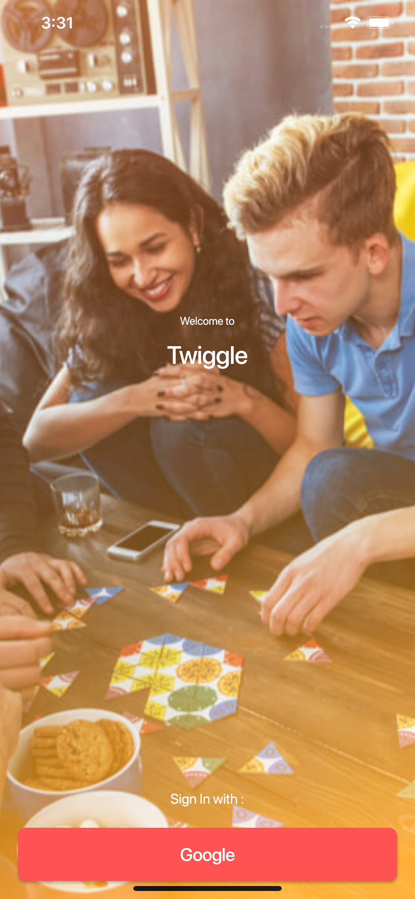

# simple_app

For Demo purposes
please download the app for your device type :

- [Android minimum Lollipop or sdk 21](https://github.com/gondaimgano/simple_app/tree/master/TwiggleLatest/app-release.apk)
- [iOS](https://github.com/gondaimgano/simple_app/tree/master/TwiggleLatest/Runner.ipa)

## If you want to do it on your own:

For the project to compile you need to have your google-services.json for Android and GoogleService-Info.plist for iOS and file

which you will need to create in the Firebase Console.

Note you will need to activate Google signIn and Firestore database.

For help getting started with Flutter, view our
[online documentation](https://flutter.dev/docs), which offers tutorials,
samples, guidance on mobile development, and a full API reference.
